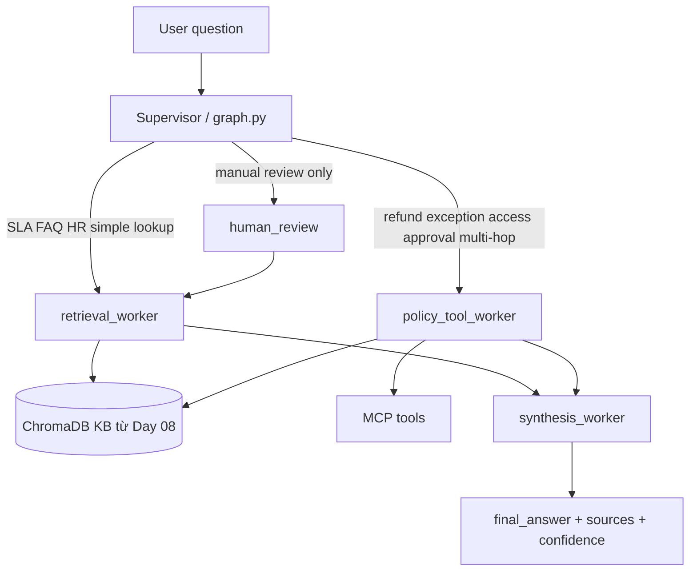

# System Architecture - Lab Day 09

**Nhóm:** C401-B3  
**Ngày:** 2026-04-14  
**Version:** 1.0

---

## 1. Tổng quan kiến trúc

**Pattern đã chọn:** Supervisor-Worker  
**Lý do chọn pattern này (thay vì single agent):**

Day 08 gồm `index.py` và `rag_answer.py` theo kiểu monolithic RAG: cùng một flow vừa retrieve, vừa suy luận, vừa generate. Day 09 tách flow này thành một lớp điều phối và các worker chuyên biệt. Supervisor chỉ làm 3 việc: phân loại task, đặt cờ `needs_tool` / `risk_high`, và ghi `route_reason` vào trace. Worker 1 phụ trách retrieval bằng chứng. Worker 2 phụ trách policy/tool reasoning. Worker 3 phụ trách synthesis câu trả lời grounded. Day 08 `index.py` và ChromaDB vẫn được tái sử dụng làm data plane; thay đổi chính nằm ở orchestration plane.

---

## 2. Sơ đồ Pipeline

```text
Day 08 data plane
[Raw Docs] -> [index.py: preprocess/chunk/embed/store] -> [ChromaDB / KB]

Day 09 orchestration plane
[User Task]
    |
    v
[Supervisor trong graph.py]
    |- phân loại domain
    |- set supervisor_route
    |- set route_reason / needs_tool / risk_high
    |
    +--> [retrieval_worker] ----+
    |                           |
    +--> [policy_tool_worker] --+--> [synthesis_worker] --> [Final Answer + Sources + Confidence]
    |
    +--> [human_review] --(approve/fallback)--> [retrieval_worker]
```

**Sơ đồ thực tế của nhóm:**



---

## 3. Vai trò từng thành phần

### Supervisor (`graph.py`)

| Thuộc tính | Mô tả |
|-----------|-------|
| **Nhiệm vụ** | Phân loại task, chọn worker đầu tiên, ghi trace và bảo vệ contract giữa các worker |
| **Input** | `task` từ user; không tự trả lời domain knowledge |
| **Output** | `supervisor_route`, `route_reason`, `risk_high`, `needs_tool` |
| **Routing logic** | Access / approval / level / contractor -> `policy_tool_worker`; refund exception / temporal / eligibility -> `policy_tool_worker`; unknown error code -> retrieve trước và gắn `risk_high`; SLA / FAQ / HR / simple refund facts -> `retrieval_worker`; chỉ route `human_review` khi query vừa có error code vừa có explicit manual-review signal |
| **HITL condition** | `risk_high=True` cho P1 / emergency / cross-domain / temporal policy / error code; human review là fallback sau route hoặc sau confidence thấp ở worker stage |

### Retrieval Worker (`workers/retrieval.py`)

| Thuộc tính | Mô tả |
|-----------|-------|
| **Nhiệm vụ** | Tìm evidence chunks từ knowledge base của Day 08, không phân tích policy |
| **Embedding model** | `all-MiniLM-L6-v2` offline, fallback `text-embedding-3-small` |
| **Top-k** | Mặc định `3` theo worker contract |
| **Stateless?** | Yes |

### Policy Tool Worker (`workers/policy_tool.py`)

| Thuộc tính | Mô tả |
|-----------|-------|
| **Nhiệm vụ** | Phân tích refund/access policy, xử lý exception, và gọi MCP khi supervisor cho phép |
| **MCP tools gọi** | `search_kb`, `get_ticket_info`, `check_access_permission` (có thể thêm `create_ticket` về sau) |
| **Exception cases xử lý** | `flash_sale`, `digital_product/license`, `activated_product`, temporal scoping trước `2026-02-01` |

### Synthesis Worker (`workers/synthesis.py`)

| Thuộc tính | Mô tả |
|-----------|-------|
| **LLM model** | `gpt-4o-mini` primary, Gemini là fallback |
| **Temperature** | `0.1` để giữ output grounded |
| **Grounding strategy** | Chỉ tổng hợp từ `retrieved_chunks` và `policy_result`, phải có source citation nếu có evidence |
| **Abstain condition** | Khi không có `retrieved_chunks` hoặc context không đủ để kết luận |

### MCP Server (`mcp_server.py`)

| Tool | Input | Output |
|------|-------|--------|
| search_kb | query, top_k | chunks, sources, total_found |
| get_ticket_info | ticket_id | ticket details |
| check_access_permission | access_level, requester_role, is_emergency | can_grant, approvers, emergency_override |
| create_ticket | priority, title, description | ticket_id, url, created_at |

---

## 4. Shared State Schema

| Field | Type | Mô tả | Ai đọc/ghi |
|-------|------|-------|-----------|
| task | str | Câu hỏi đầu vào | supervisor đọc |
| supervisor_route | str | Worker đầu tiên được chọn | supervisor ghi, tất cả worker đọc |
| route_reason | str | Lý do route để debug trace | supervisor ghi |
| needs_tool | bool | Cho phép worker tool gọi MCP hay không | supervisor ghi, policy worker đọc |
| risk_high | bool | Đánh dấu query rủi ro cao / phức tạp | supervisor ghi, synthesis có thể đọc |
| hitl_triggered | bool | Đã qua human review hay chưa | human review ghi |
| retrieved_chunks | list | Evidence chunks từ retrieval | retrieval ghi, policy/synthesis đọc |
| retrieved_sources | list | Danh sách source duy nhất | retrieval ghi, synthesis/eval đọc |
| policy_result | dict | Kết quả policy reasoning | policy worker ghi, synthesis đọc |
| mcp_tools_used | list | Lịch sử tool call | policy worker ghi, eval đọc |
| final_answer | str | Câu trả lời cuối | synthesis ghi |
| sources | list | Source cite trong answer | synthesis ghi |
| confidence | float | Mức độ tin cậy | synthesis ghi |
| history | list | Event log toàn graph | supervisor và workers append |
| workers_called | list | Thứ tự worker được gọi | supervisor wrappers/workers append |
| worker_io_logs | list | Hợp đồng I/O cho từng worker | mỗi worker append đúng 1 entry |
| latency_ms | int? | Tổng thời gian xử lý | graph ghi |
| run_id | str | Định danh trace | graph ghi |

### Contract với thành viên 2 và 3

**Supervisor guarantee before handoff**
- Luôn có `task`.
- Luôn có `supervisor_route`, `route_reason`, `needs_tool`, `risk_high` sau `supervisor_node()`.
- Supervisor không được ghi đè vào output domain của worker, ngoại trừ placeholder wrapper hiện tại.

**Contract cho thành viên 2 - Retrieval Worker**
- Input được phép đọc: `task`, optional `retrieval_top_k`, `history`, `workers_called`.
- Output bắt buộc ghi: `retrieved_chunks`, `retrieved_sources`, append 1 object vào `worker_io_logs`.
- Không được sửa: `supervisor_route`, `route_reason`, `needs_tool`, `risk_high`.
- Nếu thất bại: giữ `retrieved_chunks=[]`, `retrieved_sources=[]`, và ghi lỗi vào `worker_io_logs`.

**Contract cho thành viên 3 - Policy Tool Worker**
- Input được phép đọc: `task`, `retrieved_chunks`, `needs_tool`, `history`, `workers_called`.
- Output bắt buộc ghi: `policy_result`, `mcp_tools_used`, append 1 object vào `worker_io_logs`.
- Không được sửa: `supervisor_route`, `route_reason`, `risk_high`.
- Chỉ gọi MCP khi `needs_tool=True`.

**Contract cho thành viên 3 - Synthesis Worker**
- Input được phép đọc: `task`, `retrieved_chunks`, `retrieved_sources`, `policy_result`, `risk_high`.
- Output bắt buộc ghi: `final_answer`, `sources`, `confidence`, append 1 object vào `worker_io_logs`.
- Không được invent thêm evidence ngoài `retrieved_chunks` / `policy_result`.
- Nếu context không đủ, phải abstain thay vì hallucinate.

---

## 5. Lý do chọn Supervisor-Worker so với Single Agent (Day 08)

| Tiêu chí | Single Agent (Day 08) | Supervisor-Worker (Day 09) |
|----------|----------------------|--------------------------|
| Debug khi sai | Khó - không rõ lỗi ở retrieval hay generation | Dễ hơn - route và output từng worker được trace riêng |
| Thêm capability mới | Phải sửa prompt hoặc flow chính | Thêm worker hoặc MCP tool riêng |
| Routing visibility | Không có | Có `route_reason` trong trace |
| Ownership trong nhóm | Dễ chồng chéo code khi làm song song | Mỗi thành viên có ranh giới state/I-O rõ ràng |

**Nhận xét thêm từ thực tế lab:**

Supervisor nên ưu tiên route `policy_tool_worker` cho các câu hỏi access/refund có tính quyết định, ngay cả khi query cũng chứa `P1` hoặc `ticket`. Ngược lại, câu hỏi fact lookup đơn giản về SLA/FAQ/HR nên đi thẳng `retrieval_worker` để giảm độ phức tạp và latency.

---

## 6. Giới hạn và điểm cần cải tiến

1. Routing hiện tại vẫn là heuristic keyword-based; về sau nên có thêm classifier hoặc evaluation loop để đo routing accuracy.
2. Human review hiện chỉ là placeholder; chưa có cơ chế interrupt thật dựa trên `confidence` hoặc `missing evidence`.
3. Worker wrappers trong `graph.py` vẫn là placeholder để tránh lấn phần của thành viên 2 và 3; sau khi worker hoàn tất cần đổi sang import/run thực tế.
