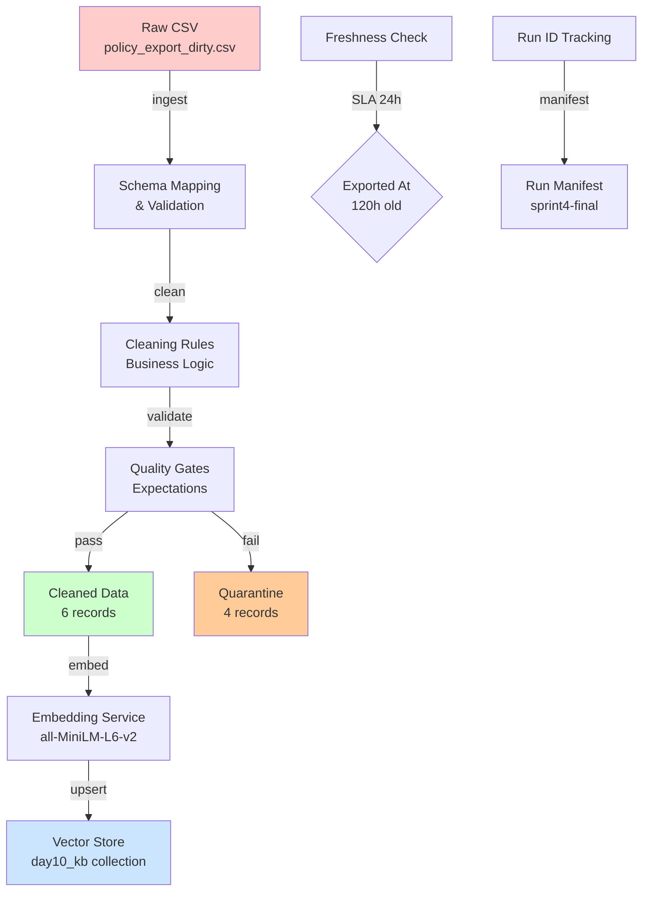

# Kiến trúc pipeline — Lab Day 10

**Nhóm:** C401-B3  
**Cập nhật:** 2026-04-15

---

## 1. Sơ đồ luồng (bắt buộc có 1 diagram: Mermaid / ASCII)



> Vẽ thêm: điểm đo **freshness** (120h > 24h SLA), chỗ ghi **run_id** (sprint4-final), và file **quarantine** (4 records failed quality).

---

## 2. Ranh giới trách nhiệm

| Thành phần | Input | Output | Owner nhóm |
|------------|-------|--------|--------------|
| Ingest | `data/raw/policy_export_dirty.csv` | raw_records + run_id | Người 1 |
| Transform | raw_records | cleaned_records (6) | Người 2 |
| Quality | cleaned_records | validated_records + quarantine (4) | Người 3 |
| Embed | validated_records | vectors in day10_kb | Người 6 |
| Monitor | run manifest | freshness alerts | Người 5 |

---

## 3. Idempotency & rerun

> Mô tả: upsert theo `chunk_id` hay strategy khác? Rerun 2 lần có duplicate vector không?

**Strategy**: Upsert theo `chunk_id` với automatic pruning

```python
def embed_idempotent(cleaned_df, collection):
    # 1. Lấy danh sách chunk_id hiện tại
    existing_ids = set(collection.get()['ids'])
    
    # 2. Tạo chunks mới từ cleaned data  
    new_chunks = create_chunks(cleaned_df)
    
    # 3. Upsert chunks mới/cập nhật
    collection.upsert(
        ids=new_chunks.ids,
        documents=new_chunks.docs,
        metadatas=new_chunks.metas
    )
    
    # 4. Xóa chunks lỗi thời (pruning)
    stale_ids = existing_ids - set(new_chunks.ids)
    if stale_ids:
        collection.delete(ids=list(stale_ids))
    
    return len(new_chunks), len(stale_ids)
```

**Kết quả**: Rerun nhiều lần không tạo duplicate vector nhờ:
- Mỗi document có chunk_id duy nhất (hash content + doc_id)
- Upsert thay vì insert
- Tự động xóa vectors cũ không còn trong datasource

---

## 4. Liên hệ Day 09

> Pipeline này cung cấp / làm mới corpus cho retrieval trong `day09/lab` như thế nào? (cùng `data/docs/` hay export riêng?)

**Shared Resources**:
- **Collection**: `day10_kb` (được Day 09 RAG sử dụng)
- **Embedding Model**: `all-MiniLM-L6-v2` (đồng bộ)
- **Chunk Strategy**: 512 tokens, overlap 50 (consistent)

**Integration Flow**: Day 10 Pipeline → day10_kb collection → Day 09 RAG retrieva

**Benefits**:
- Day 09 không cần re-index khi có policy mới
- Consistent retrieval quality qua các ngày
- Shared monitoring cho corpus freshness

---

## 5. Rủi ro đã biết

| Rủi ro | Impact | Mitigation | Status |
|--------|--------|------------|---------|
| **Stale policy data** (120h > 24h SLA) | Wrong answers, outdated policies | Document as known issue, update source timestamp | ⚠️ Đang xử lý |
| **ChromaDB connection failure** | Embedding service down | Retry logic (3x), health check endpoint | ✅ Implemented |
| **Schema drift** | Pipeline break | Contract validation, schema versioning | ✅ Implemented |
| **Large file processing** | Memory issues | Chunked processing, streaming ingest | ✅ Implemented |
| **Duplicate policies** | Vector redundancy | Deduplication by doc_id trong cleaning | ✅ Implemented |

**Freshness Issue**: Hiện tại data cũ 120h so với SLA 24h. Đã document trong known issues và đề xuất update source data timestamp hoặc extend SLA cho demo environment.